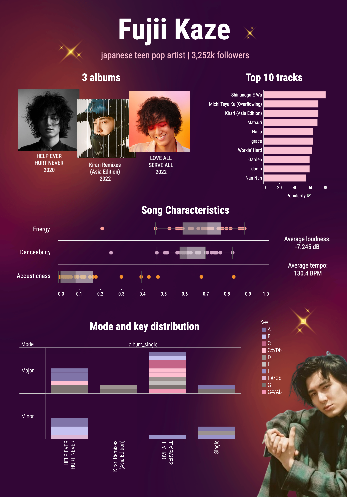

# Spotify-ArtistSong-Analysis

## Overview
This project aims to gain insights into the characteristics and trends of the artist's songs. By leveraging the Spotify API, the track data of the artist is extracted, transformed, and analyzed to uncover interesting patterns and information. The extraction and transformation processes are implemented in Python, while the analysis process is performed in SQL. The discovered insights are visualized with Tableau. Below are the links to each component of the project:

- [Spotify API functions](myFunctions.py)
- [Extract & Transform](extract_transform_track.ipynb)
- [Analysis](analyze_track.sql)
- [Visualization](https://public.tableau.com/views/draft_song/Dashboard22?:language=en-US&:sid=&:display_count=n&:origin=viz_share_link)

In this case study, the artist of focus is Fujii Kaze, a Japanese singer-songwriter and musician under Universal Music Japan. By analyzing his songs, I aim to gain deeper insights into his musical style, trends in his song releases, and the preferences of his audience. Nevertheless, the [Spotify API functions](myFunctions.py) can be leveraged to retrieve data on songs from other artists as well. Therefore, feel free to utilize the code and expand the analysis for the songs of your favorite artists.

## Data extraction and transformation

The functions to retrieve data from Spotify API were written in [myFunctions.py](myFunctions.py) file. In [extract_transform_track.ipynb](extract_transform_track.ipynb), those functions were called to get four datasets along with some artist information. Initially, **general data** about the artist's tracks was collected. Subsequently, the track IDs were utilized to obtain the **audio analysis** and **audio feature** data for these tracks. The maximum number of tracks that can be retrieved is **50**, based on the artist's recent top tracks. After merging the track data, some information about their **albums** was also retrieved. Although these datasets contain numerous attributes, the project focuses on the following selected attributes from each dataset. The selection criteria prioritize simplicity and the developer's familiarity with the attributes.

**1. Track data: general information of the track.**

| Variable          | Description                                                                                                    |
|-------------------|----------------------------------------------------------------------------------------------------------------|
| track_id          | The unique id of each track.                                                                                   |
| track_name        | The name of each track.                                                                                        |
| href              | A link to the Web API endpoint providing full details of the track.                                            |
| popularity        | The popularity of the track. [0, 100], calculated by the Spotify's algorithm.                                   |
| uri               | The Spotify URI for the album.                                                                                 |
| album_id          | The album's id of each track.                                                                                  |

**2. Track's analysis data: a low-level audio analysis of the track.**

| Variable          | Description                                                                                                    |
|-------------------|----------------------------------------------------------------------------------------------------------------|
| duration          | Length of the track in seconds.                                                                                |
| loudness          | The overall loudness of a track in decibels (dB). The typical range is [-60,0].                                |
| tempo             | The overall estimated tempo of a track in beats per minute (BPM).                                              |
| time_signature    | The estimated time signature.                                                                                  |
| key               | The key the track is in. Integers map to pitches using standard Pitch Class notation.                          |
| mode              | Mode indicates the modality (major or minor) of a track                                                        |

**3. Track's features data: audio feature information of the track.**

| Variable          | Description                                                                                                    |
|-------------------|----------------------------------------------------------------------------------------------------------------|
| track_id          | The unique id of each track.                                                                                   |
| acousticness      | A confidence measure from 0.0 to 1.0 of whether the track is acoustic.                                         |
| energy            | Energy is a measure from 0.0 to 1.0 and represents a perceptual measure of intensity and activity.             |
| danceability      | How suitable a track is for dancing from 0.0 to 1.0 based on a combination of musical elements                 |

**4. Album data: general information of the album.**

| Variable          | Description                                                                                                    |
|-------------------|----------------------------------------------------------------------------------------------------------------|
| album_id          | The unique id of each album.                                                                                   |
| album_name        | The name of each album.                                                                                        |
| album_type        | The type of the album (single, album, compilation).                                                            |
| album_popularity  | The popularity of the album. [0, 100], calculated by the Spotify's algorithm.                                   |
| release_date      | The date the album was first released.                                                                         |
| total_tracks      | The number of tracks in the album.                                                                             |
| album_uri         | The Spotify URI for the album.                                                                                 |
| album_href        | A link to the Web API endpoint providing full details of the album.                                            |

For more details on each attribute, please refer to the [Spotify for Developers official website](https://developer.spotify.com/documentation/web-api).

Following the extraction, the datasets were merged and transformed by 

**1. Checking null values and duplications**
- No null values or duplications in any entries.

**2. Adjusting albums**
- Dropped cover albums *HELP EVER HURT COVER* and *LOVE ALL COVER ALL* to focus on original songs.
- Removed the compilation album *Best of Fujii Kaze 2020-2024* as it contains duplicated versions of popular songs.
- Noted that *Kirari Remixes (Asia Edition)* should have 9 tracks, but only 2 were retrieved due to the API limitation.
- There are two *Hana* albums with the same name but different versions. One contains an original song while the other contains a ballad version. For simplicity, focused on the original song and dropped the album with the track *Hana-Balad* as it should have four versions, but only two were retrieved.

**3. Addressing duplication tracks with Japanese titles**
- *Matsuri* from the album *LOVE ALL COVER ALL* has a duplicated single version with a Japanese title (*まつり*). Since the audio analysis and features are very similar, we decided to keep the one with the English title due to its inclusion in the album and higher popularity.
- *Hademo Ne-Yo -LASA edit* has its original version titled in Japanese (*へでもねーよ*). As the audio analysis and features differ, we kept both versions and translated the Japanese title to English (*Hademo Ne-Yo*).
- *Kirari* from *Kirari Remixes (Asia Edition)* is titled in Japanese (*きらり*). However, there is also a Kirari track from the album LOVE ALL COVER ALL, so we renamed this one to *Kirari (Asia Edition)*.

**4. Mapping analysis attributes**
- Mapped the key and mode integers back to their original values (e.g. Major or Minor, and C, C#/Db, D, ..., B).
- Converted the time signature format from x to x/4.

After extraction and transformation, **21 entries** were removed, resulting in a dataset containing **29 entries**. It's worth noting that some attributes, such as 'href' and 'uri', may not be immediately usable in the analysis process. However, they were retained for references and further development.

The Python script for extraction and transformation can be found [here](extract_transform_track.ipynb).

## Data analysis
To derive the insights, the following analyses were performed.
1. Identifying the top 10 popular tracks.
2. Deriving album details, including name, release year, total tracks, and the most popular track in the album.
3. Tracking song popularity by released year, including average values and the top track for each year.
4. Analyzing key, mode, and time signature distributions. This was done for all tracks and each album.
5. Examining average duration, loudness, and tempo. This analysis was conducted for all tracks and each album.
6. Inspecting average acousticness, energy, and danceability. This analysis was conducted for all tracks and each album.

The SQL script for this data analysis can be found [here](track_analyze.sql).

## Data visualization
The visualization was created using Tableau Public. It showcases three albums and the **top 10 tracks** in a horizontal bar chart. Additionally, various **song characteristics** such as energy, acousticness, and danceability are depicted through box plots. To the right of the box plots, the average values of tempo and loudness are displayed. Furthermore, the **mode and key distribution** of each album and single are visualized in a vertical bar chart. In this chart, the rows represent the mode, the columns represent the album or single, and the count of tracks is represented in different colors, each corresponding to a different key.

Clicking on certain attributes allows them to be used as filters for other visualizations. For instance, clicking on the album name filters the song characteristics, as well as the key and mode distribution, to display only data related to that specific album.

Furthermore, additional details were provided on hover:
- Albums: Album name, release year, total tracks, and the top track of that album.
- Each track in the top 10 tracks: The track name, album name or single, and track duration in minutes.
- Each point in the song characteristic box plot: The track name, album name or single, and the corresponding values between 0 and 1 (energy, danceability, or acousticness).
- Each bar in the mode and key distribution: The track name, album name or single, key, mode, and time signature.
     

The interactive dashboard can be found [here](https://public.tableau.com/views/draft_song/Dashboard22?:language=en-US&:sid=&:display_count=n&:origin=viz_share_link).

## Key findings
**1. Albums:** Fujii Kaze has released 3 original albums: *HELP EVER HURT NEVER*, *LOVE ALL SERVE ALL*, and *Kirari Remixes (Asia Edition)*. Additionally, there are 2 cover albums, *HELP EVER HURT COVER* and *LOVE ALL COVER ALL*, and 1 compilation album, *Best of Fujii Kaze 2020-2024*, which are not included in the analysis and visualization.
   
**2. Top 10 tracks:** The top 10 tracks by Fujii Kaze are *Shinunoga E-Wa, Michi Teyu Ku (Overflowing), Kirari (Asia Edition), Matsuri, Hana, grace, Workin' Hard, Garden, damn, and Nan-Nan*. It is noteworthy that the popularity is not directly correlated with the number of views on Spotify streaming. According to Spotify's official website for developers, *'The popularity is calculated by algorithm and is based, in the most part, on the total number of plays the track has had and how recent those plays are. Generally speaking, songs that are being played a lot now will have a higher popularity than songs that were played a lot in the past.'*
   
**3. Song characteristics:**
  - Most of Fujii Kaze's songs, including singles and tracks across all albums, exhibit high danceability and energy values. This indicates that his songs are mostly lively and upbeat. The low acousticness suggests that his songs are likely more electronic, contributing to their energetic vibe.
- Notably, the song *Bye for now* from the album *LOVE ALL SERVE ALL* stands out from the boxplots with its lowest energy and danceability, but the highest acousticness. This particular track is characterized by the sound of the piano, evoking a slow and somewhat nostalgic vibe, which contrasts with the typical upbeat nature of Fujii Kaze's music.
- On average, Fujii Kaze's songs have a loudness of -7dB, which is relatively high compared to the typical range of [-60,0] dB. The average tempo across his albums is 130.4 BPM. From fastest to slowest, the albums are *LOVE ALL SERVE ALL* (138.0 BPM), *HELP EVER HURT NEVER* (126.3 BPM), and *Kirari Remixes (Asia Edition)* (116.0 BPM). The tempos of the first two albums fall within the Allegro range, characterized by fast and bright rhythms, while Kirari Remixes (Asia Edition) falls within the Moderato range. These tempos are commonly associated with dance and electronic music genres. [Note: Data for Kirari Remixes (Asia Edition) is incomplete].

In conclusion, it seems that Fujii Kaze has created music that is perfect for getting people moving and feeling pumped up! 

**4. Mode, key, and time signature distribution:**
- Approximately 70% of the retrieved tracks are in the major mode, contributing to a bright and cheerful vibe. Especially the album *LOVE ALL SERVE ALL*, 10 out of 11 tracks are in Major mode.
- The top 3 most used keys in Fujii Kaze's songs are A, G, and C#/Db. The album "LOVE ALL SERVE ALL" demonstrates the most variety in the keys used.
- Only one song from the retrieved data uses a 3/4 time signature, which is *Kazeyo* from *HELP EVER HURT NEVER*.

